# INFORME FINAL DEL PROYECTO

## LexiSing: Plataforma de Comunicación Inclusiva mediante Lengua de Señas Colombiana

---

**(PORTADA — Normas APA 7)**

[//]: # "Insertar aquí el logo institucional del SENA."

**SERVICIO NACIONAL DE APRENDIZAJE — SENA**

**Programa de Formación:** Tecnólogo en Análisis y Desarrollo de Software (ADSO)
**Ficha:** 3203082

**Proyecto Formativo:** LexiSing — Plataforma de Comunicación Inclusiva mediante Lengua de Señas Colombiana

**Aprendices:**
- Beickert Gabriel Torres Tapia
- Samuel Castro Zuñiga
- Cielo Alexandra Rodríguez Pardo
- Juan Steban Riveros Orozco

**Instructores:**
- Steffi Velandia
- Jose David Luna

**Ciudad y fecha de presentación:** (Ciudad), septiembre de 2026

---

## TABLA DE CONTENIDO

**Página de título** (Portada)

**1. INTRODUCCIÓN**
- 1.1 Contexto
- 1.2 Descripción General del Proyecto
- 1.3 Objetivo del Documento

**2. PLANTEAMIENTO DEL PROBLEMA**
- 2.1 Descripción del Problema
- 2.2 Justificación
- 2.3 Alcance
- 2.4 Limitaciones

**3. OBJETIVOS**
- 3.1 Objetivo General
- 3.2 Objetivos Específicos

**4. MARCO REFERENCIAL**
- 4.1 Marco Conceptual
- 4.2 Marco Legal

**5. ANÁLISIS DEL SISTEMA**
- 5.1 Actores
- 5.2 Requerimientos Funcionales
- 5.3 Requerimientos No Funcionales
- 5.4 Casos de Uso
- 5.5 Historias de Usuario
- 5.6 Product Backlog
- 5.7 MVP Definido

**6. DISEÑO DEL SISTEMA**
- 6.1 Arquitectura del Sistema
- 6.2 Diagrama de Componentes
- 6.3 Modelo Entidad Relación (MER) — Firestore Collections
- 6.4 Diccionario de Datos
- 6.5 Wireframes
- 6.6 Flujo de Navegación

**7. IMPLEMENTACIÓN DEL PROYECTO**
- 7.1 Configuración del Entorno
- 7.2 Estructura del Proyecto
- 7.3 Implementación de Base de Datos
- 7.4 Definición de API
- 7.5 Desarrollo por Sprint

**8. PRUEBAS DEL SISTEMA**
- 8.1 Plan de Pruebas
- 8.2 Diseño de Casos de Prueba
- 8.3 Pruebas Manuales
- 8.4 Pruebas Automatizadas
- 8.5 Gestión de Incidencias
- 8.6 Evidencias de Ejecución

**9. DESPLIEGUE DEL SISTEMA**
- 9.1 Arquitectura de Despliegue
- 9.2 Servicios Utilizados
- 9.3 Configuración del Entorno Productivo
- 9.4 URL del Sistema
- 9.5 Evidencias de Funcionamiento

**10. COSTOS**
- 10.1 Estimación de Costos
- 10.2 Costos Operativos Mensuales

**11. RESULTADOS OBTENIDOS**
- 11.1 Cumplimiento de Objetivos
- 11.2 Funcionalidades Implementadas
- 11.3 Beneficios Obtenidos

**12. CONCLUSIONES**

**13. RECOMENDACIONES**

**14. REFERENCIAS**

**15. ANEXOS**
- Anexo A: Estructura de directorios del proyecto
- Anexo B: Configuración de Firebase
- Anexo C: Configuración de variables de entorno
- Anexo D: Código fuente del servicio de reconocimiento de señas
- Anexo E: Código fuente del servicio de formalización de IA
- Anexo F: Reglas de seguridad Firestore
- Anexo G: Configuración de CI/CD
- Anexo H: Evidencias de pruebas automatizadas (Selenium)
- Anexo J: Documento de propuesta técnica y económica
- Anexo K: Bitácora de sprints

*Nota: la numeración de páginas se genera automáticamente al convertir a Word/PDF (campo de índice en el documento).*

---

## LISTA DE FIGURAS

**Figura 1.** Diagrama de casos de uso del sistema (Sección 5.4).
**Figura 2.** Arquitectura del sistema (Sección 6.1).
**Figura 3.** Diagrama de componentes (Sección 6.2).
**Figura 4.** Modelo entidad-relación de Firestore (Sección 6.3).
**Figura 5.** Wireframe — Vista de inicio de sesión (Sección 6.5).
**Figura 6.** Wireframe — Formulario de registro de usuario (Sección 6.5).
**Figura 7.** Wireframe — Panel de administración con estadísticas (Sección 6.5).
**Figura 8.** Wireframe — Lista de conversaciones con indicador de presencia (Sección 6.5).
**Figura 9.** Wireframe — Vista de chat con cámara activa (Sección 6.5).
**Figura 10.** Wireframe — Monitoreo de conversaciones del supervisor (Sección 6.5).
**Figura 11.** Wireframe — Panel de gestión de usuarios (Sección 6.5).
**Figura 12.** Wireframe — Configuración de perfil de usuario (Sección 6.5).
**Figura 13.** Flujo de navegación del sistema (Sección 6.6).
**Figura 14.** Evidencia de ejecución — Botones de autenticación social (Sección 8.6).
**Figura 15.** Evidencia de ejecución — Flujo de autenticación con Microsoft (Sección 8.6).
**Figura 16.** Arquitectura de despliegue en entorno de desarrollo local (Sección 9.1).
**Figura 17.** Evidencia de funcionamiento — Dashboard del rol supervisor (Sección 9.5).
**Figura 18.** Evidencia de funcionamiento — Reporte de mensajes por hora (Sección 9.5).

*Nota: la numeración de páginas se genera automáticamente al convertir a Word/PDF.*

---

## LISTA DE TABLAS

**Tabla 1.** Actores del sistema (Sección 5.1).
**Tabla 2.** Requerimientos funcionales (Sección 5.2).
**Tabla 3.** Requerimientos no funcionales (Sección 5.3).
**Tabla 4.** Historias de usuario (Sección 5.5).
**Tabla 5.** Product Backlog priorizado (Sección 5.6).
**Tabla 6.** Funcionalidades del MVP (Sección 5.7).
**Tabla 7.** Colección «usuarios» de Firestore (Sección 6.4).
**Tabla 8.** Colección «conversaciones» de Firestore (Sección 6.4).
**Tabla 9.** Subcolección «mensajes» de Firestore (Sección 6.4).
**Tabla 10.** Colección «activities» de Firestore (Sección 6.4).
**Tabla 11.** Requisitos previos del entorno (Sección 7.1).
**Tabla 12.** Endpoints del backend Django REST Framework (Sección 7.4).
**Tabla 13.** Servicios frontend Angular (Sección 7.4).
**Tabla 14.** Plan de pruebas del sistema (Sección 8.1).
**Tabla 15.** Casos de prueba del sistema (Sección 8.2).
**Tabla 16.** Incidencias encontradas durante el desarrollo (Sección 8.5).
**Tabla 17.** Servicios utilizados en el proyecto (Sección 9.2).
**Tabla 18.** Estimación de costos del proyecto (Sección 10.1).
**Tabla 19.** Costos operativos mensuales (Sección 10.2).
**Tabla 20.** Cumplimiento de los objetivos (Sección 11.1).
**Tabla 21.** Funcionalidades implementadas (Sección 11.2).

*Nota: la numeración de páginas se genera automáticamente al convertir a Word/PDF.*

---

## RESUMEN

El presente informe documenta el desarrollo de LexiSing, una plataforma web de comunicación inclusiva diseñada para facilitar la interacción entre personas sordas o mudas y usuarios oyentes mediante el reconocimiento de Lengua de Señas Colombiana (LSC) en tiempo real. El sistema integra tecnologías de vanguardia como MediaPipe HandLandmarker para la detección de gestos manuales, inteligencia artificial mediante Groq API para la formalización de texto, y una arquitectura basada en Angular 20, Django REST Framework y Firebase Firestore para garantizar comunicaciones en tiempo real. LexiSing reconoce 400+ señas de palabras, 27 letras del abecedario dactilológico LSC y léxico empresarial, permitiendo a las personas sordas comunicarse de manera fluida en entornos laborales y educativos. El proyecto fue desarrollado bajo la metodología Scrum en cuatro sprints, cumpliendo con los objetivos planteados de inclusión social, accesibilidad digital y transformación tecnológica con enfoque humano.

---

## ABSTRACT

This document presents the development of LexiSing, an inclusive web platform designed to facilitate communication between deaf or mute individuals and hearing users through real-time Colombian Sign Language (LSC) recognition. The system integrates cutting-edge technologies such as MediaPipe HandLandmarker for hand gesture detection, artificial intelligence via Groq API for text formalization, and an architecture based on Angular 20, Django REST Framework, and Firebase Firestore for real-time communications. LexiSing recognizes 33 word signs, 27 letters of the LSC dactylological alphabet, and enterprise vocabulary, enabling deaf individuals to communicate fluidly in work and educational environments. The project was developed under the Scrum methodology in four sprints, meeting the established objectives of social inclusion, digital accessibility, and human-centered technological transformation.

---

## PALABRAS CLAVE

Reconocimiento de señas, Comunicación inclusiva, Inteligencia artificial, Lengua de Señas Colombiana, Accesibilidad digital.

---

## 1. INTRODUCCIÓN

### 1.1 Contexto

La comunicación es un derecho fundamental del ser humano y un pilar esencial para la inclusión social, laboral y educativa. Sin embargo, las personas sordas o mudas enfrentan barreras significativas en su interacción cotidiana con el mundo oyente. En Colombia, según datos del Departamento Administrativo Nacional de Estadística (DANE), aproximadamente 460.000 personas presentan alguna discapacidad auditiva, y la mayoría depende de la Lengua de Señas Colombiana (LSC) como su principal medio de comunicación.

En entornos laborales, educativos y de atención al público, la falta de personal capacitado en LSC genera situaciones de exclusión, malentendidos y dificultades para acceder a servicios básicos. Las organizaciones que desean ser inclusivas carecen de herramientas tecnológicas efectivas que permitan una comunicación bidireccional en tiempo real entre personas sordas y oyentes.

### 1.2 Descripción General del Proyecto

LexiSing es una plataforma web de comunicación inclusiva que permite a personas sordas o mudas interactuar con usuarios oyentes mediante el reconocimiento en tiempo real de Lengua de Señas Colombiana. El sistema utiliza la cámara del dispositivo para detectar gestos manuales a través de MediaPipe HandLandmarker, traduce las señas identificadas a palabras clave y, mediante inteligencia artificial (Groq API), las convierte en frases gramaticalmente correctas en español formal.

La plataforma integra un sistema de chat en tiempo real basado en Firebase Firestore, autenticación segura con múltiples proveedores (correo electrónico, Google y Microsoft), gestión de roles y permisos, panel de administración, monitoreo de conversaciones, y un sistema de notificaciones sonoras. El reconocimiento de señas incluye 400+ señas de palabras (incluyendo léxico empresarial), 27 letras del abecedario dactilológico LSC, y dos modos de operación: modo palabras y modo deletreo.

### 1.3 Objetivo del Documento

El presente informe tiene como objetivo documentar de forma integral el proceso de desarrollo del proyecto LexiSing, desde el planteamiento del problema hasta los resultados obtenidos, incluyendo el análisis, diseño, implementación, pruebas y despliegue del sistema. Este documento sirve como evidencia académica del cumplimiento de los objetivos de formación del programa Tecnólogo en Análisis y Desarrollo de Software del SENA.

---

## 2. PLANTEAMIENTO DEL PROBLEMA

### 2.1 Descripción del Problema

Actualmente existe una gran dificultad de comunicación entre personas oyentes y personas sordas o mudas en entornos laborales, educativos y de atención al público. La falta de conocimiento del lenguaje de señas obliga a depender de intérpretes o comunicación escrita, lo que genera retrasos, malentendidos y situaciones de exclusión.

Las personas sordas o mudas enfrentan barreras de comunicación en:

- **Empresas**: Atención al cliente, reuniones y procesos administrativos.
- **Instituciones públicas**: Trámites, atención ciudadana y servicios públicos.
- **Centros educativos**: Aulas, tutorías y procesos académicos.
- **Áreas de atención al cliente**: Bancos, tiendas, hospitales y servicios de salud.

Esta situación ocurre porque la mayoría de personas no conocen lenguaje de señas, generando barreras de comunicación, problemas de inclusión, malentendidos y baja accesibilidad. La dependencia de intérpretes humanos es costosa, limitada en disponibilidad y no siempre accesible en el momento requerido.

### 2.2 Justificación

LexiSing es importante porque:

- **Mejora la inclusión social y laboral** de las personas con discapacidad auditiva, facilitando su acceso a oportunidades de empleo y educación.
- **Facilita la comunicación accesible** mediante tecnología innovadora que traduce señas en tiempo real.
- **Reduce errores de interpretación** al utilizar inteligencia artificial para formalizar el texto generado a partir de las señas detectadas.
- **Fortalece políticas de accesibilidad** en las organizaciones que implementen la plataforma.
- **Mejora la atención al cliente** al permitir una comunicación directa y fluida entre personas sordas y oyentes.
- **Promueve igualdad de oportunidades** al eliminar barreras comunicativas que históricamente han excluido a la comunidad sorda.

Además, permite que las organizaciones modernicen sus procesos de atención inclusiva mediante tecnología inteligente, impulsando la transformación digital con enfoque humano.

### 2.3 Alcance

**El sistema LexiSing incluye:**

- Autenticación de usuarios con múltiples proveedores (correo, Google, Microsoft).
- Reconocimiento de 400+ señas de palabras en tiempo real mediante cámara.
- Reconocimiento de 27 letras del abecedario dactilológico LSC (modo deletreo).
- Léxico empresarial con 8 señas bimanuales adicionales.
- Formalización de texto mediante inteligencia artificial (Groq API).
- Chat en tiempo real entre usuarios con mensajes de texto.
- Edición y eliminación de mensajes.
- Gestión de usuarios con roles (admin, empleado, sordomudo, supervisor, usuario).
- Panel de administración con dashboard y estadísticas.
- Monitoreo de conversaciones con filtros por participante y fecha.
- Notificaciones sonoras de mensajes.
- Indicador de presencia online/offline.
- Registro de actividad de usuarios.
- Reglas de seguridad en Firestore con RBAC.
- Pipeline CI/CD con GitHub Actions.

**No incluye:**

- Aplicación móvil nativa (Android/iOS).
- Reconocimiento avanzado de señas complejas o expresiones regionales.
- Funcionamiento sin conexión a internet.
- Implementación masiva a nivel nacional en esta fase inicial.
- Integración con sistemas de videoconferencia externos.

### 2.4 Limitaciones

- El reconocimiento de señas depende de la calidad de la cámara y las condiciones de iluminación del entorno.
- El vocabulario de señas reconocidas está limitado a 33 palabras, 27 letras y 8 términos empresariales; no cubre todo el léxico de la LSC.
- La formalización de texto mediante IA puede generar resultados inexactos cuando las secuencias de señas no son coherentes.
- El sistema requiere conexión a internet para el funcionamiento del chat en tiempo real, la autenticación y la formalización con IA.
- Las letras ambiguas del abecedario (A, E, S, M, N, Ñ, O, R) pueden generar falsos positivos a pesar del mecanismo de retención extendida.
- No se implementó despliegue en servidor de producción; el sistema funciona en entorno de desarrollo local.

---

## 3. OBJETIVOS

### 3.1 Objetivo General

Desarrollar una plataforma web de comunicación inclusiva que permita la interacción entre personas sordas o mudas y usuarios oyentes mediante traducción de Lengua de Señas Colombiana (LSC) en tiempo real y mensajería digital.

### 3.2 Objetivos Específicos

1. Implementar autenticación segura de usuarios con múltiples proveedores (correo electrónico, Google y Microsoft) mediante Firebase Authentication.
2. Desarrollar un módulo de reconocimiento de señas en tiempo real utilizando MediaPipe HandLandmarker para la detección de 400+ señas de palabras, 27 letras del abecedario dactilológico LSC y léxico empresarial.
3. Implementar un servicio de formalización de texto mediante inteligencia artificial (Groq API) que convierta secuencias de glosas en español formal.
4. Gestionar conversaciones y mensajes en tiempo real mediante Firebase Firestore con operaciones de creación, edición y eliminación.
5. Implementar un sistema de roles y permisos (admin, empleado, sordomudo, supervisor, usuario) con reglas de seguridad en Firestore.
6. Desarrollar un panel de administración y monitoreo con estadísticas de uso del sistema.
7. Garantizar la accesibilidad y usabilidad de la interfaz web mediante Angular Material y diseño responsive.
8. Implementar un pipeline de integración continua con GitHub Actions para build y verificación de código.

---

## 4. MARCO REFERENCIAL

### 4.1 Marco Conceptual

**Lengua de Señas Colombiana (LSC):** Lengua natural utilizada por la comunidad sorda de Colombia como medio de comunicación. Se compone de señas manuales, expresiones faciales y corporales. El abecedario dactilológico LSC consta de 27 letras que se forman con configuraciones específicas de los dedos de la mano.

**Reconocimiento de Gestos:** Tecnología de visión por computador que permite detectar e interpretar movimientos y posiciones de la mano en tiempo real. En el contexto de LexiSing, se utiliza para identificar señas de la LSC a partir de la cámara del dispositivo.

**MediaPipe HandLandmarker:** Framework de Google para la detección de manos en tiempo real. Extrae 21 landmarks (puntos de referencia) por mano, permitiendo hasta 2 manos simultáneas. Funciona directamente en el navegador (client-side) sin necesidad de servidor.

**Inteligencia Artificial para Formalización:** Uso de modelos de lenguaje para convertir secuencias de palabras clave (glosas) en texto gramaticalmente correcto. LexiSing utiliza la API de Groq con el modelo qwen/qwen3.8-27b para este propósito.

**Firebase:** Plataforma de desarrollo de aplicaciones de Google que ofrece servicios de autenticación (Firebase Authentication), base de datos en tiempo real (Firestore), y reglas de seguridad. Firestore es una base de datos NoSQL basada en documentos que permite sincronización en tiempo real.

**Angular:** Framework de desarrollo web de Google basado en TypeScript. LexiSing utiliza Angular 20.3 con Angular Material para la interfaz de usuario, SSR (Server-Side Rendering) para rendimiento, y arquitectura basada en componentes.

**Django REST Framework:** Framework de Python para el desarrollo de APIs REST. LexiSing lo utiliza como backend para la formalización de texto y gestión de usuarios, con autenticación basada en Firebase ID tokens.

**Scrum:** Metodología ágil de gestión de proyectos que organiza el trabajo en ciclos iterativos llamados sprints. LexiSing fue desarrollado en 4 sprints de aproximadamente 2 semanas cada uno.

**RBAC (Role-Based Access Control):** Modelo de control de acceso basado en roles que restringe el acceso a recursos del sistema según el rol asignado al usuario. LexiSing implementa 5 roles: admin, empleado, sordomudo, supervisor y usuario.

### 4.2 Marco Legal

**Ley 1581 de 2012 (Colombia):** Por la cual se dictan disposiciones generales para la protección de datos personales. Establece los principios de legalidad, finalidad, libertad, veracidad, seguridad y confidencialidad en el tratamiento de datos personales. LexiSing cumple con esta ley al implementar reglas de seguridad en Firestore que restringen el acceso a datos personales según el rol del usuario.

**Ley 1346 de 2009 (Colombia):** Por la cual se adopta la Convención sobre los Derechos de las Personas con Discapacidad y su Protocolo Facultativo. Esta ley obliga al Estado colombiano a garantizar el acceso a la tecnología asistiva y la accesibilidad digital para personas con discapacidad. LexiSing contribuye al cumplimiento de esta ley al提供 una herramienta de comunicación accesible.

**Ley Estatutaria 1618 de 2013 (Colombia):** Establece disposiciones para garantizar el ejercicio pleno de los derechos de las personas con discapacidad, incluyendo el derecho a la educación, el trabajo y la participación social. LexiSing facilita el acceso al empleo y la educación para personas sordas.

**Normas MinTIC:** El Ministerio de Tecnologías de la Información y las Comunicaciones de Colombia establece directrices para la accesibilidad web y la transformación digital inclusiva. LexiSing se alinea con estas directrices al implementar una plataforma web accesible.

**Convención Interamericana para la Eliminación de Todas las Formas de Discriminación contra las Personas con Discapacidad (1999):** Colombia es signataria de esta convención que promueve la igualdad de oportunidades y la eliminación de barreras para personas con discapacidad.

---

## 5. ANÁLISIS DEL SISTEMA

### 5.1 Actores

Los actores del sistema se detallan en la Tabla 1 (Actores del sistema).

**Tabla 1.** Actores del sistema.

| Actor | Descripción | Funciones principales |
|-------|-------------|----------------------|
| **Administrador** | Persona encargada de gestionar el sistema | Administra usuarios, reportes y configuraciones del sistema. Puede editar y eliminar usuarios, controlar permisos de acceso. |
| **Empleado** | Usuario de atención al público | Utiliza el traductor para comunicarse con personas sordas. Gestiona mensajes enviados y recibidos. |
| **Persona sorda o muda** | Usuario principal del sistema | Realiza señas que son reconocidas por la cámara y traducidas a texto. Envía y recibe mensajes. |
| **Supervisor** | Encargado de monitoreo | Consulta reportes y estadísticas. Monitorea conversaciones con filtros por participante y fecha. |
| **Sistema IA** | Motor de inteligencia artificial | Interpreta las señas detectadas y genera traducciones formales mediante Groq API. |

### 5.2 Requerimientos Funcionales

Los requerimientos funcionales se detallan en la Tabla 2 (Requerimientos funcionales).

**Tabla 2.** Requerimientos funcionales.

| Código | Actor | Requerimiento | Descripción |
|--------|-------|---------------|-------------|
| RF01 | Persona sorda | Gestionar Mensajes | Enviar, editar, eliminar y recibir mensajes en el chat |
| RF02 | Empleado | Gestionar Mensajes | Enviar, editar, eliminar y recibir mensajes en el chat |
| RF03 | Administrador | Gestionar usuarios | Editar y eliminar usuarios del sistema |
| RF04 | Supervisor | Generar reportes | Consultar estadísticas y reportes de actividad |
| RF05 | Empleado | Iniciar sesión | Acceder al sistema con credenciales (correo, Google, Microsoft) |
| RF06 | Usuario | Consultar historial | Revisar conversaciones y mensajes anteriores |
| RF07 | Usuario | Cerrar sesión | Salir del sistema de forma segura |
| RF08 | Persona sorda | Grabar Señas | Capturar video de señas mediante cámara y reconocer gestos en tiempo real |
| RF09 | Persona sorda | Formalizar texto | Convertir secuencias de glosas en texto formal mediante IA |
| RF10 | Supervisor | Monitorear conversaciones | Visualizar conversaciones con filtros por participante y fecha |
| RF11 | Administrador | Controlar permisos | Asignar y modificar roles de usuarios |
| RF12 | Usuario | Recuperar contraseña | Restablecer contraseña en caso de olvido |

### 5.3 Requerimientos No Funcionales

Los requerimientos no funcionales se detallan en la Tabla 3 (Requerimientos no funcionales).

**Tabla 3.** Requerimientos no funcionales.

| Código | Categoría | Requerimiento | Descripción |
|--------|-----------|---------------|-------------|
| RNF1 | Seguridad | Protección de datos | Cumplimiento de la Ley 1581 de 2012 para protección de datos personales |
| RNF2 | Rendimiento | Tiempo de respuesta | Formalización de texto menor a 15 segundos; chat en tiempo real con latencia < 300ms |
| RNF3 | Usabilidad | Interfaz intuitiva | Diseño accesible y fácil de usar para cualquier tipo de usuario |
| RNF4 | Disponibilidad | Alta disponibilidad | Sistema activo mínimo 95% del tiempo |
| RNF5 | Compatibilidad | Multiplataforma | Funcionar en navegadores Chrome, Firefox, Edge y Safari (computador) |
| RNF6 | Accesibilidad | Diseño inclusivo | Navegación accesible para personas sordas con indicadores visuales |
| RNF7 | Seguridad | Autenticación robusta | Firebase Authentication con JWT tokens y refresh tokens |
| RNF8 | Escalabilidad | Arquitectura cloud | Firebase Firestore con escalabilidad automática |

### 5.4 Casos de Uso

**Caso de Uso 1: Iniciar sesión**

- **Actor principal:** Cualquier usuario
- **Precondiciones:** El usuario debe tener una cuenta registrada
- **Flujo principal:**
  1. El usuario accede a la página de inicio de sesión.
  2. Ingresa credenciales (correo/contraseña) o selecciona proveedor (Google/Microsoft).
  3. El sistema valida las credenciales con Firebase Authentication.
  4. El sistema redirige al usuario a la vista correspondiente según su rol.
- **Flujo alterno:**
  - Si las credenciales son inválidas, el sistema muestra un mensaje de error.
  - Si el usuario no tiene cuenta, puede registrarse.
  - Si olvidó la contraseña, puede recuperarla.

**Caso de Uso 2: Grabar y traducir señas**

- **Actor principal:** Persona sorda o muda
- **Precondiciones:** El usuario debe tener una cámara disponible y haber iniciado sesión
- **Flujo principal:**
  1. El usuario activa la cámara en la vista de chat.
  2. Selecciona el modo de reconocimiento (Palabras o Deletreo).
  3. Realiza las señas frente a la cámara.
  4. MediaPipe HandLandmarker detecta los landmarks de la mano.
  5. El sistema clasifica la seña y la agrega como chip (modo palabras) o letra (modo deletreo).
  6. El usuario presiona "Formalizar" para enviar la secuencia a la IA.
  7. Groq API convierte las glosas en texto formal.
  8. El texto formal se envía como mensaje en el chat.
- **Flujo alterno:**
  - Si la cámara no está disponible, el sistema muestra un error.
  - Si la IA no responde, se utiliza el fallback (unión de palabras con espacios).

**Caso de Uso 3: Gestionar mensajes**

- **Actor principal:** Persona sorda o empleado
- **Precondiciones:** El usuario debe tener una conversación activa
- **Flujo principal:**
  1. El usuario escribe un mensaje o genera uno desde señas.
  2. Envía el mensaje a la conversación.
  3. El mensaje se almacena en Firestore y se entrega en tiempo real al destinatario.
  4. El usuario puede editar o eliminar mensajes propios.
- **Flujo alterno:**
  - Si el usuario intenta editar un mensaje ajeno, el sistema lo rechaza.

**Caso de Uso 4: Consultar historial de conversaciones**

- **Actor principal:** Cualquier usuario autenticado
- **Precondiciones:** El usuario debe tener conversaciones previas
- **Flujo principal:**
  1. El usuario accede a la lista de conversaciones.
  2. Selecciona una conversación.
  3. El sistema carga los mensajes ordenados cronológicamente.
  4. El usuario puede revisar mensajes anteriores con scroll.

**Caso de Uso 5: Generar reportes y estadísticas**

- **Actor principal:** Supervisor
- **Precondiciones:** El usuario debe tener rol de supervisor
- **Flujo principal:**
  1. El supervisor accede al módulo de reportes.
  2. Selecciona el tipo de reporte (mensajes por hora, actividad de usuarios, conversaciones).
  3. El sistema genera las estadísticas y las muestra en gráficos.
  4. El supervisor puede filtrar por participante y fecha.
- **Flujo alterno:**
  - Si ocurre un error en la generación, el sistema muestra un mensaje de error controlado.

**Caso de Uso 6: Cerrar sesión**

- **Actor principal:** Cualquier usuario
- **Precondiciones:** El usuario debe tener una sesión activa
- **Flujo principal:**
  1. El usuario presiona el botón de cerrar sesión.
  2. El sistema limpia la sesión de Firebase Auth y localStorage.
  3. El sistema redirige a la página de inicio de sesión.

El diagrama de casos de uso consolida los flujos anteriores:

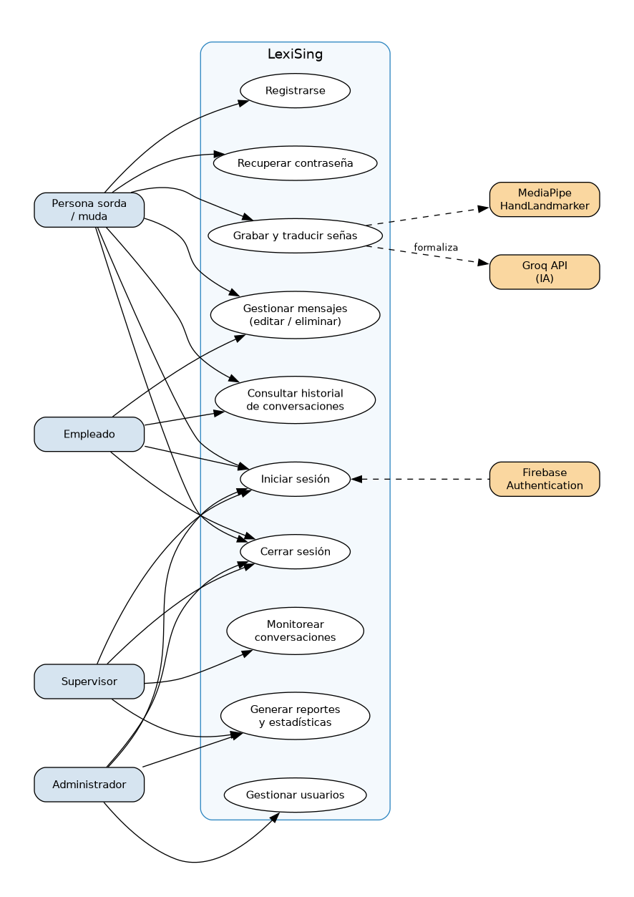

**Figura 1.** Diagrama de casos de uso del sistema.

### 5.5 Historias de Usuario

Las historias de usuario se detallan en la Tabla 4 (Historias de usuario).

**Tabla 4.** Historias de usuario.

| ID | Historia de usuario |
|----|---------------------|
| HU01 | Como usuario, quiero iniciar sesión en el sistema para acceder de manera segura a mis conversaciones. |
| HU02 | Como persona sorda, quiero grabar mensajes en lenguaje de señas para comunicarme con otras personas. |
| HU03 | Como persona sorda, quiero enviar mensajes grabados para compartir información de manera clara. |
| HU04 | Como persona sorda, quiero editar mensajes enviados para corregir errores antes o después de enviarlos. |
| HU05 | Como persona sorda, quiero eliminar mensajes para administrar mejor mis conversaciones. |
| HU06 | Como empleado, quiero recibir mensajes traducidos para comprender las solicitudes de los usuarios sordos. |
| HU07 | Como empleado, quiero gestionar mensajes recibidos para mantener una comunicación organizada. |
| HU08 | Como usuario, quiero cerrar sesión de forma segura para proteger mi información personal. |
| HU09 | Como usuario, quiero consultar el historial de conversaciones para revisar mensajes anteriores. |
| HU10 | Como administrador, quiero editar información de usuarios para mantener los datos actualizados. |
| HU11 | Como administrador, quiero eliminar usuarios para controlar el acceso al sistema. |
| HU12 | Como supervisor, quiero generar reportes para monitorear el funcionamiento del sistema. |
| HU13 | Como supervisor, quiero consultar estadísticas de actividad para evaluar el uso de la plataforma. |
| HU14 | Como usuario, quiero recuperar mi contraseña para volver a acceder al sistema en caso de olvido. |
| HU15 | Como persona sorda, quiero recibir mensajes dentro de la plataforma para mantener conversaciones activas. |
| HU16 | Como empleado, quiero responder mensajes recibidos para continuar la comunicación con el usuario. |
| HU17 | Como supervisor, quiero monitorear la actividad de los usuarios para verificar el uso correcto del sistema. |
| HU18 | Como administrador, quiero controlar permisos de acceso para garantizar la seguridad del sistema. |

### 5.6 Product Backlog

El Product Backlog se detalla en la Tabla 5 (Product Backlog priorizado).

**Tabla 5.** Product Backlog priorizado.

| Prioridad | ID | Funcionalidad | Módulo |
|-----------|-----|---------------|--------|
| Alta | HU01 | Inicio de sesión de usuarios | Autenticación |
| Alta | HU02 | Grabación de mensajes en lenguaje de señas | Cámara |
| Alta | HU03 | Envío de mensajes grabados | Comunicación |
| Alta | HU06 | Recepción de mensajes traducidos | Comunicación |
| Alta | HU07 | Gestión de mensajes | Mensajería |
| Alta | HU08 | Cierre de sesión seguro | Seguridad |
| Alta | HU09 | Consulta de historial de conversaciones | Historial |
| Alta | HU15 | Recepción de mensajes dentro de la plataforma | Comunicación |
| Media | HU10 | Edición de usuarios | Administración |
| Media | HU11 | Eliminación de usuarios | Administración |
| Media | HU12 | Generación de reportes | Reportes |
| Media | HU13 | Consulta de estadísticas | Reportes |
| Media | HU16 | Respuesta a mensajes | Comunicación |
| Baja | HU14 | Recuperación de contraseña | Seguridad |
| Baja | HU17 | Monitoreo de actividad de usuarios | Supervisión |
| Baja | HU18 | Gestión de permisos y accesos | Seguridad |

### 5.7 MVP Definido

El MVP (Producto Mínimo Viable) de LexiSing está enfocado en validar la experiencia principal del usuario: permitir una comunicación básica entre una persona sorda y un empleado mediante traducción de señas y texto.

**Funcionalidades del MVP:**

Las funcionalidades del MVP se detallan en la Tabla 6 (Funcionalidades del MVP).

**Tabla 6.** Funcionalidades del MVP.

| Funcionalidad | Descripción |
|---------------|-------------|
| Inicio de sesión | Los usuarios podrán ingresar al sistema mediante credenciales seguras (correo, Google, Microsoft). |
| Cierre de sesión | El sistema permitirá finalizar sesiones activas de manera segura. |
| Grabación de mensajes en señas | La persona sorda podrá grabar mensajes utilizando la cámara del sistema con reconocimiento MediaPipe. |
| Envío de mensajes | Los usuarios podrán enviar mensajes dentro de las conversaciones activas. |
| Recepción de mensajes | Los usuarios podrán recibir mensajes enviados por otros usuarios en tiempo real. |
| Edición de mensajes | El sistema permitirá modificar mensajes enviados previamente. |
| Eliminación de mensajes | Los usuarios podrán eliminar mensajes dentro de las conversaciones. |
| Historial de conversaciones | El sistema almacenará conversaciones para permitir consultas posteriores. |
| Consulta de reportes | El supervisor podrá visualizar reportes básicos de actividad y uso del sistema. |
| Gestión básica de conversaciones | El sistema organizará los mensajes enviados y recibidos dentro de cada conversación. |

**Usuarios beneficiados en el MVP:**

- Personas sordas o mudas.
- Empleados de atención al cliente.
- Empresas e instituciones que requieran mejorar la comunicación inclusiva.
- Supervisores encargados del monitoreo del sistema.

**Resultado esperado del MVP:**

Al finalizar el desarrollo del MVP, LexiSing permite una comunicación funcional entre usuarios mediante mensajes grabados en lenguaje de señas y gestión básica de conversaciones. El sistema garantiza acceso seguro mediante autenticación, comunicación organizada entre usuarios, almacenamiento de conversaciones y monitoreo básico de actividad mediante reportes.

---

## 6. DISEÑO DEL SISTEMA

### 6.1 Arquitectura del Sistema

LexiSing implementa una arquitectura de tres capas (frontend, backend, servicios cloud) con separación de responsabilidades:

**Frontend (Angular 20.3):**
- Arquitectura basada en componentes con lazy loading de rutas.
- Angular Material para componentes de interfaz.
- MediaPipe HandLandmarker para reconocimiento de señas (client-side).
- Firebase Angular Fire para conexión directa con Firestore.
- SSR (Server-Side Rendering) para mejorar rendimiento y SEO.

**Backend (Django 6.0 + DRF 3.17):**
- API REST para formalización de texto con IA.
- Autenticación basada en Firebase ID tokens.
- Servicio GroqService para integración con Groq API.
- Arquitectura modular con apps independientes (users, text).

**Servicios Cloud (Firebase + Google Cloud):**
- Firebase Authentication para autenticación multi-proveedor.
- Firebase Firestore para base de datos NoSQL en tiempo real.
- Firebase Hosting para despliegue del frontend.
- Reglas de seguridad Firestore con RBAC.

La Figura 2 ilustra la arquitectura de tres capas del sistema:

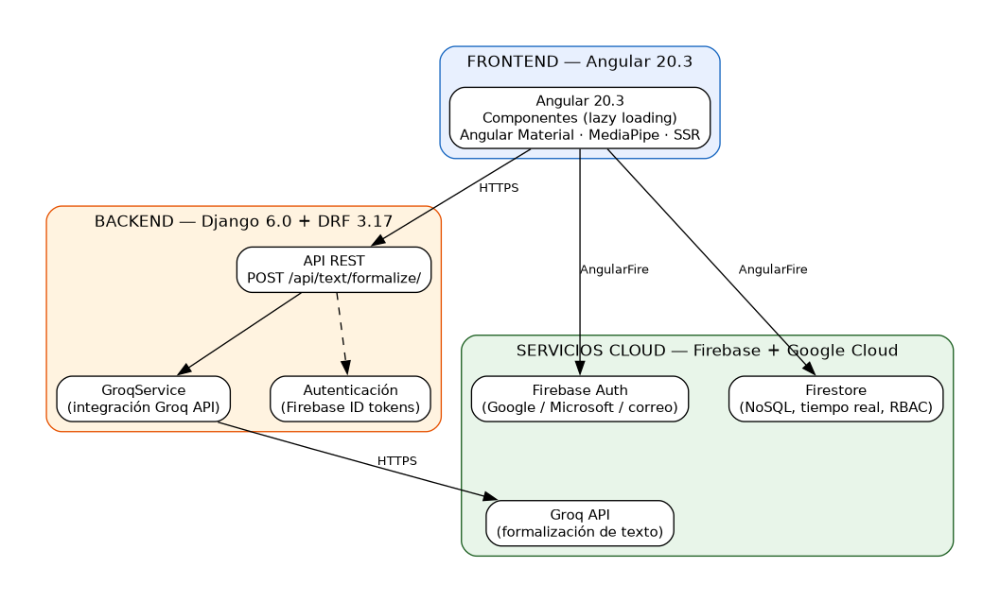

**Figura 2.** Arquitectura del sistema.

### 6.2 Diagrama de Componentes

La Figura 3 muestra los componentes del sistema, sus servicios transversales y las conexiones con los servicios externos (Firebase y Groq API) y el backend:

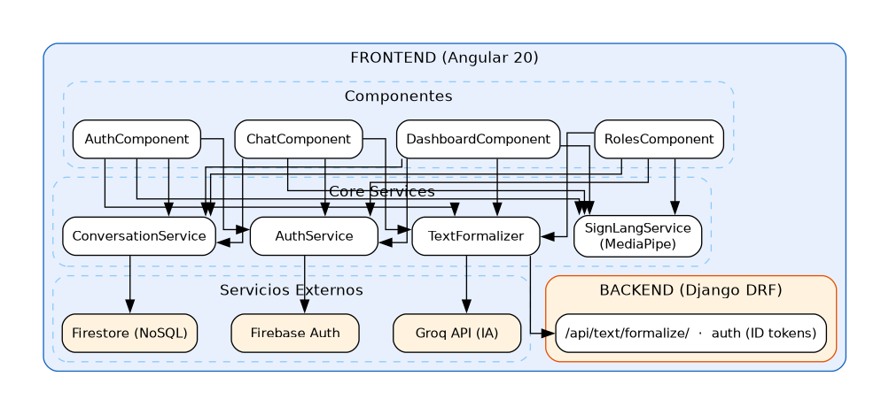

**Figura 3.** Diagrama de componentes.

Se destaca el flujo de formalización de texto: el `TextFormalizer` en el frontend envía las glosas detectadas al endpoint `POST /api/text/formalize/` del backend (Django DRF), que a través del `GroqService` consulta la Groq API y devuelve el texto formal al chat.

### 6.3 Modelo Entidad Relación (MER) — Firestore Collections

Firestore es una base de datos NoSQL basada en documentos. A continuación se describe la estructura de colecciones y documentos (ver Figura 4):

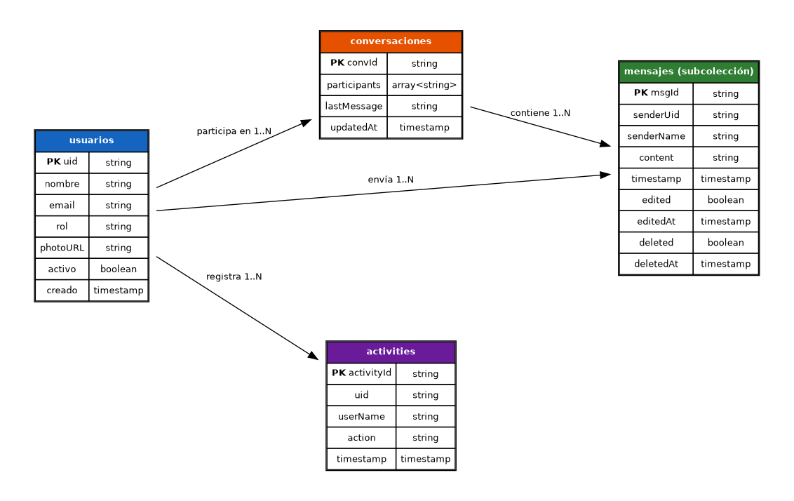

**Figura 4.** Modelo entidad-relación de Firestore.

### 6.4 Diccionario de Datos

**Colección: usuarios**

La estructura de la colección «usuarios» se detalla en la Tabla 7 (Colección «usuarios» de Firestore).

**Tabla 7.** Colección «usuarios» de Firestore.

| Campo | Tipo | Descripción | Restricción |
|-------|------|-------------|-------------|
| uid | string | Identificador único del usuario (Firebase Auth) | Obligatorio, único |
| nombre | string | Nombre completo del usuario | Obligatorio, máx. 150 caracteres |
| email | string | Correo electrónico | Obligatorio, único |
| rol | string | Rol del usuario en el sistema | Obligatorio, enum: admin, empleado, sordomudo, supervisor, usuario |
| photoURL | string | Foto de perfil en formato base64 | Opcional |
| activo | boolean | Estado de la cuenta | Obligatorio, default: true |
| creado | timestamp | Fecha de creación | Automático |

**Colección: conversaciones**

La estructura de la colección «conversaciones» se detalla en la Tabla 8 (Colección «conversaciones» de Firestore).

**Tabla 8.** Colección «conversaciones» de Firestore.

| Campo | Tipo | Descripción | Restricción |
|-------|------|-------------|-------------|
| participants | array\<string\> | UIDs de los participantes | Obligatorio, mín. 2 elementos |
| lastMessage | string | Último mensaje de la conversación | Opcional |
| updatedAt | timestamp | Última actualización | Automático |

**Subcolección: mensajes**

La estructura de la subcolección «mensajes» se detalla en la Tabla 9 (Subcolección «mensajes» de Firestore).

**Tabla 9.** Subcolección «mensajes» de Firestore.

| Campo | Tipo | Descripción | Restricción |
|-------|------|-------------|-------------|
| senderUid | string | UID del remitente | Obligatorio |
| senderName | string | Nombre del remitente | Obligatorio |
| content | string | Contenido del mensaje | Obligatorio |
| timestamp | timestamp | Fecha y hora del mensaje | Automático |
| edited | boolean | Indica si el mensaje fue editado | Default: false |
| deleted | boolean | Indica si el mensaje fue eliminado | Default: false |

**Colección: activities**

La estructura de la colección «activities» se detalla en la Tabla 10 (Colección «activities» de Firestore).

**Tabla 10.** Colección «activities» de Firestore.

| Campo | Tipo | Descripción | Restricción |
|-------|------|-------------|-------------|
| uid | string | UID del usuario que realizó la acción | Obligatorio |
| userName | string | Nombre del usuario | Obligatorio |
| action | string | Descripción de la acción realizada | Obligatorio |
| timestamp | timestamp | Fecha y hora de la actividad | Automático |

### 6.5 Wireframes

Los wireframes se evidencian con **capturas reales de la aplicación funcionando en el navegador**, generadas por la suite Selenium (Anexo H). Las Figuras 5 a 12 muestran las vistas principales del sistema:

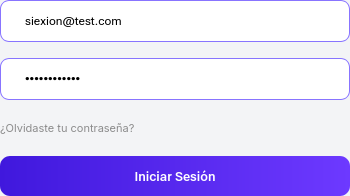

**Figura 5.** Vista de inicio de sesión (login) con opciones de correo, Google y Microsoft.

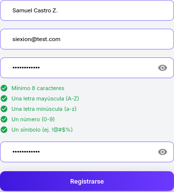

**Figura 6.** Formulario de registro de usuario.

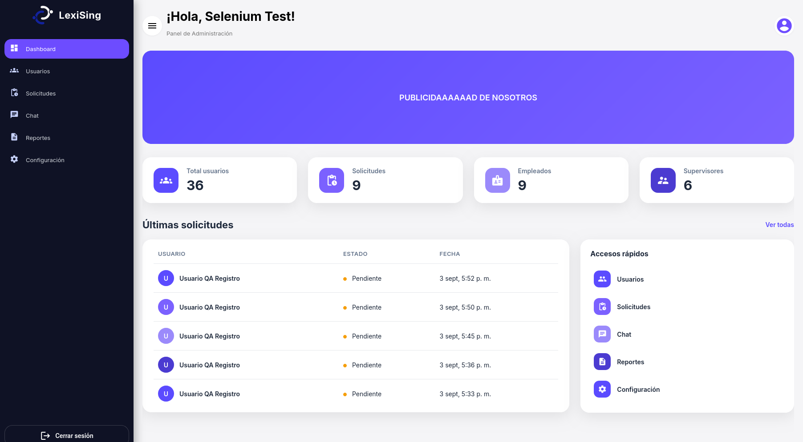

**Figura 7.** Panel de administración (dashboard) con estadísticas.

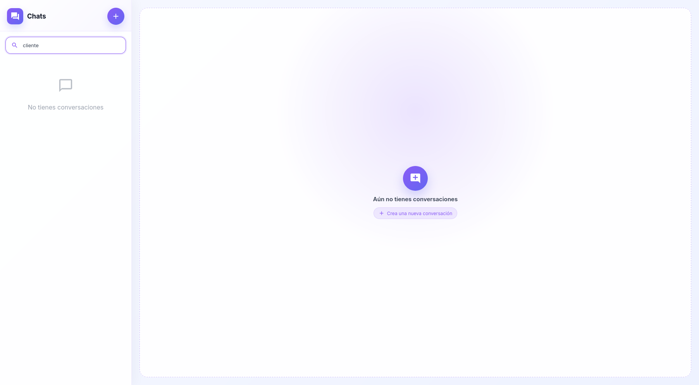

**Figura 8.** Lista de conversaciones con indicador de presencia.

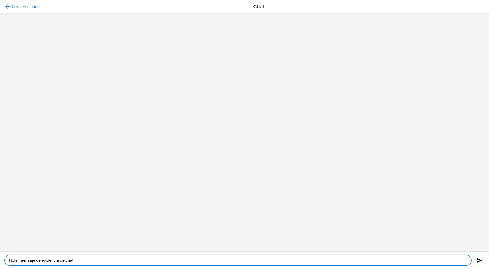

**Figura 9.** Vista de chat con cámara activa y panel de traducción de señas.

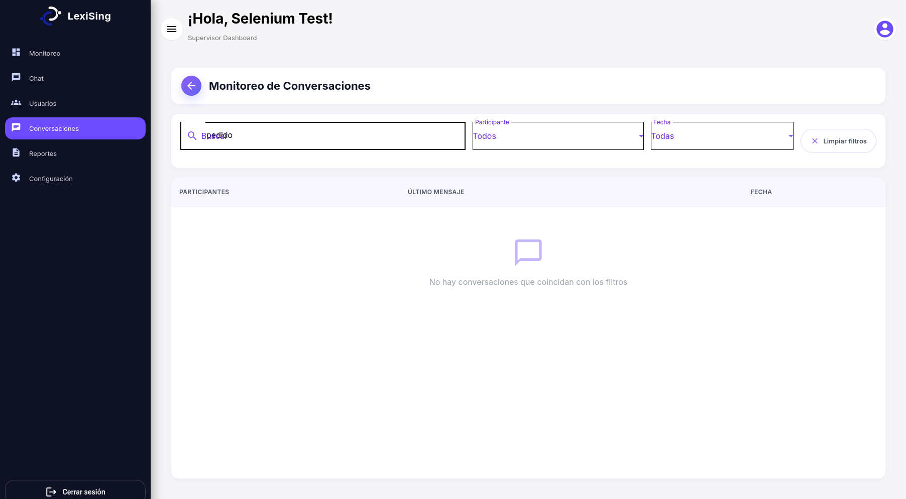

**Figura 10.** Panel del supervisor con monitoreo de conversaciones y filtros.

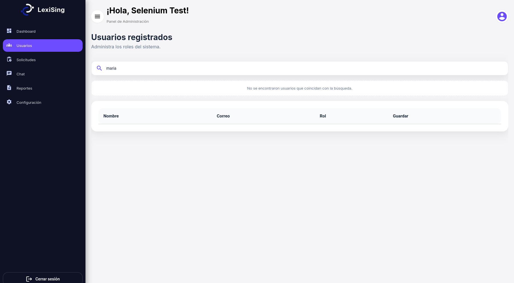

**Figura 11.** Panel de gestión de usuarios (administrador).

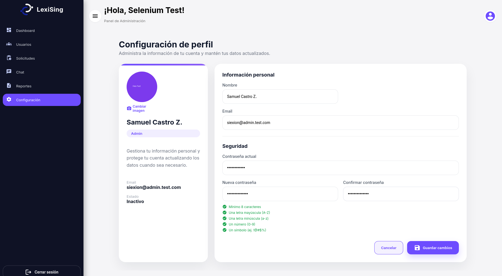

**Figura 12.** Configuración de perfil de usuario.

> **Nota:** el reconocimiento de señas con cámara activa sobre video real requiere cámara y sesión autenticada con datos en Firestore; el módulo que lo integra se evidencia en las capturas `14`/`23` y en la Figura 9.

### 6.6 Flujo de Navegación

La Figura 13 muestra el flujo de navegación del sistema:

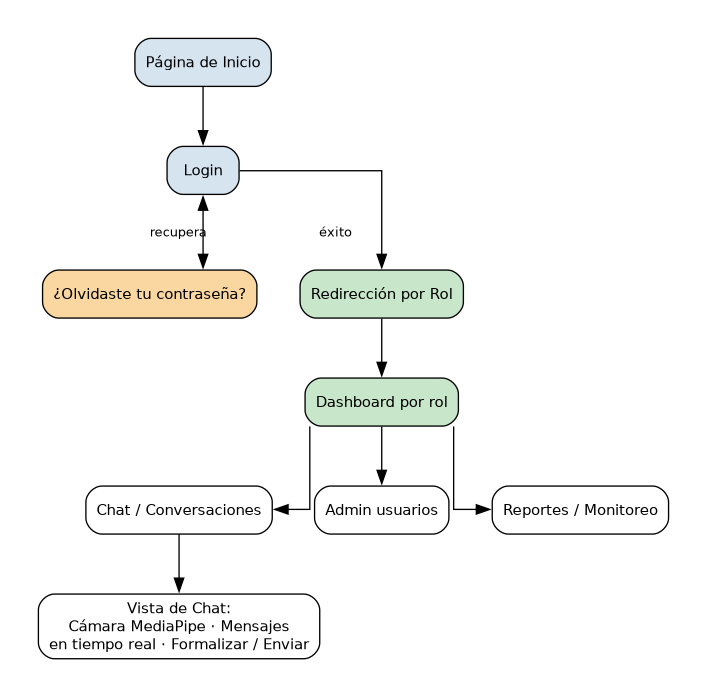

**Figura 13.** Flujo de navegación del sistema.

---

## 7. IMPLEMENTACIÓN DEL PROYECTO

### 7.1 Configuración del Entorno

**Requisitos previos:**

Los requisitos previos del entorno se detallan en la Tabla 11 (Requisitos previos del entorno).

**Tabla 11.** Requisitos previos del entorno.

| Componente | Tecnología | Versión |
|------------|-----------|---------|
| Runtime Backend | Python | 3.14 |
| Framework Backend | Django | 6.0.5 |
| API REST | Django REST Framework | 3.17.1 |
| Runtime Frontend | Node.js | 20+ |
| Framework Frontend | Angular CLI | 20.3.27 |
| TypeScript | TypeScript | 5.9.2 |
| Base de datos | Firebase Firestore | NoSQL |
| Autenticación | Firebase Authentication | - |
| IA | Groq API | - |
| Control de versiones | Git | - |
| CI/CD | GitHub Actions | - |

**Variables de entorno:**

```
# Backend (.env)
GROQ_API_KEY=gsk_xxxxx

# Firebase (firebase-key.json)
{credenciales del proyecto Firebase}

# Frontend (environment.ts)
apiKey: "xxxxx"
authDomain: "xxxxx.firebaseapp.com"
projectId: "xxxxx"
storageBucket: "xxxxx.appspot.com"
appId: "xxxxx"
```

### 7.2 Estructura del Proyecto

```
LexiSing/
├── back_lexiSing/                    # Backend Django + DRF
│   ├── lexising/                     # Configuración del proyecto
│   │   ├── settings.py              # Settings (env vars, DRF, CORS)
│   │   ├── urls.py                  # Routing principal
│   │   ├── asgi.py
│   │   └── wsgi.py
│   ├── app/core/                     # Módulo core
│   │   ├── authentication.py        # FirebaseAuthentication (DRF)
│   │   └── firebase.py             # Inicialización Firebase + Firestore
│   ├── users/                        # App: gestión de usuarios
│   │   ├── models.py               # UserProfile (uid, nombre, email)
│   │   ├── views.py                # APIViews (HealthCheck, UserProfile, UsersList)
│   │   ├── urls.py                 # Rutas /api/users/, /api/health/
│   │   └── migrations/
│   ├── text/                         # App: formalización de texto con IA
│   │   ├── serializers.py          # Validación de input (gestos + contexto)
│   │   ├── services.py             # GroqService (llamada a Groq API + fallback)
│   │   ├── views.py                # TextFormalizeView (POST /api/text/formalize/)
│   │   └── urls.py                 # Ruta del endpoint
│   ├── manage.py
│   ├── requirements.txt             # Dependencias Python
│   ├── .env                         # Variables de entorno (GROQ_API_KEY)
│   └── firebase-key.json            # Credenciales Firebase
│
├── front-lexi-sing/                  # Frontend Angular 20
│   ├── src/app/
│   │   ├── core/
│   │   │   ├── services/
│   │   │   │   ├── sign-language.service.ts   # Detección de señas LSC (MediaPipe)
│   │   │   │   ├── camera.service.ts          # Captura de cámara (getUserMedia)
│   │   │   │   ├── text-formalizer.service.ts # Llamada a /api/text/formalize/
│   │   │   │   ├── conversation.service.ts    # CRUD conversaciones (Firestore)
│   │   │   │   ├── notification.service.ts    # Notificaciones sonoras
│   │   │   │   ├── presence.service.ts        # Presencia online/offline
│   │   │   │   ├── activity.service.ts        # Registro de actividad
│   │   │   │   ├── dashboard.service.ts       # Datos del panel de administración
│   │   │   │   ├── user-api.service.ts        # Cliente de APIs de usuarios
│   │   │   │   ├── auth.service.ts            # Firebase Auth
│   │   │   │   └── error.service.ts           # Toast de errores
│   │   │   ├── guards/               # auth.guard, role.guard
│   │   │   ├── interceptors/         # Firebase token interceptor
│   │   │   └── models/               # Interfaces TypeScript
│   │   └── features/
│   │       ├── auth/                  # Login, register, forgot-password
│   │       ├── chat/                  # conversation-list + chat
│   │       ├── dashboard/             # Panel de administración
│   │       └── roles/                 # Paneles por rol (admin, empleado, sordomudo, supervisor)
│   ├── firebase.json
│   ├── firestore.rules               # Reglas de seguridad Firestore
│   └── package.json
│
├── .github/workflows/ci.yml         # Pipeline CI/CD
├── .gitignore
└── README.md
```

### 7.3 Implementación de Base de Datos

La base de datos principal es **Firebase Firestore** (NoSQL). El backend Django también utiliza SQLite para el modelo `UserProfile`, pero la lógica principal de datos opera sobre Firestore.

**Colecciones Firestore:**

1. **usuarios** — Almacena perfiles de usuario con roles y datos básicos.
2. **conversaciones** — Almacena metadatos de conversaciones (participantes, último mensaje, fecha).
3. **conversaciones/{convId}/mensajes** — Subcolección con mensajes de cada conversación.
4. **activities** — Registro de actividad de usuarios para auditoría.

**Reglas de seguridad Firestore:**

- Los usuarios autenticados pueden leer perfiles de otros usuarios (para búsqueda en chat).
- Un usuario solo puede crear su propio perfil con rol inicial 'usuario'.
- Un usuario solo puede editar campos inofensivos en su propio perfil (nombre, email, foto), nunca su rol.
- Admin/supervisor pueden editar y eliminar cualquier usuario.
- Las conversaciones son visibles solo para sus participantes (o admin/supervisor).
- Los mensajes solo pueden ser escritos por participantes de la conversación.
- La actividad global es legible para autenticados; escritura solo de registros propios.

### 7.4 Definición de API

**Endpoints del Backend Django:**

Los endpoints del backend se detallan en la Tabla 12 (Endpoints del backend).

**Tabla 12.** Endpoints del backend (Django REST Framework).

| Método | Endpoint | Auth | Descripción |
|--------|----------|------|-------------|
| GET | `/api/health/` | No | Health check del backend |
| GET | `/api/users/me/` | Sí | Perfil del usuario autenticado |
| GET | `/api/users/` | No | Lista de todos los usuarios |
| GET/POST | `/api/conversations/` | Sí | Listar/crear conversaciones |
| POST | `/api/text/formalize/` | Sí | Formalizar glosas de señas con IA |

**Ejemplo: Formalizar texto**

```bash
curl -X POST http://localhost:8000/api/text/formalize/ \
  -H "Content-Type: application/json" \
  -H "Authorization: Bearer <FIREBASE_ID_TOKEN>" \
  -d '{"gestos": ["HOLA", "NECESITO", "AYUDA"], "contexto": "chat de soporte"}'
```

**Respuesta:**

```json
{
  "texto_formal": "Hola, necesito ayuda.",
  "gestos_originales": ["HOLA", "NECESITO", "AYUDA"],
  "fuente": "groq"
}
```

**Servicios Frontend (Angular):**

Los servicios del frontend se detallan en la Tabla 13 (Servicios frontend).

**Tabla 13.** Servicios frontend (Angular).

| Servicio | Responsabilidad |
|----------|-----------------|
| `AuthService` | Autenticación Firebase, persistencia de sesión, roles |
| `SignLanguageService` | Detección de señas LSC con MediaPipe, clasificación de gestos |
| `CameraService` | Captura de cámara WebRTC (getUserMedia) |
| `TextFormalizerService` | Llamada a `/api/text/formalize/` para formalización con IA |
| `ConversationService` | CRUD de conversaciones y mensajes en Firestore |
| `NotificationService` | Notificaciones sonoras de mensajes entrantes |
| `PresenceService` | Indicador de presencia online/offline |
| `ActivityService` | Registro de actividad de usuarios |
| `DashboardService` | Datos para el panel de administración |
| `UserApiService` | Cliente HTTP para APIs de usuarios |

### 7.5 Desarrollo por Sprint

#### Sprint 1: Fundamentos y Autenticación (Junio 2026)

**Objetivo:** Establecer la infraestructura del proyecto, autenticación de usuarios y chat básico.

**Commits principales:**
- `551a3e7` — Estilos de botones de inicio de sesión y registro
- `ef35b91` — Conexión Firebase y autenticación con frontend
- `a36d001` — Corrección botones de inicio de sesión con manejo de estado
- `619dab6` — Mejora del diseño del dashboard y conversaciones
- `4220a4d` — Mejoras de estilos en dashboard y conversaciones
- `cb8805d` — Corrección Firestore para recibir usuarios
- `0554029` — Corrección responsive barra
- `58601b9` — Estilo al dashboard
- `8f105c6` — Implementar cámara en lista de conversaciones y mejorar interfaz
- `6433dc1` — Panel de supervisor con rutas y componentes
- `41bea40` — Conexión dashboard y mejora interfaz de chat

**Entregables:**
- Proyecto Angular 20 configurado con SSR
- Proyecto Django 6.0 con DRF configurado
- Firebase Authentication funcionando (correo)
- Login y registro de usuarios
- Dashboard básico
- Chat con mensajes en tiempo real (Firestore)
- Cámara integrada en la vista de chat
- Panel de supervisor con navegación

**Duración:** 2 semanas

---

#### Sprint 2: Roles y Gestión de Usuarios (Julio 2026)

**Objetivo:** Implementar sistema de roles, gestión de usuarios y paneles específicos por rol.

**Commits principales:**
- `329dfdd` — Rutas y componentes para panel del supervisor
- `c1f6a78` — Edición y eliminación de mensajes, contador de usuarios en línea
- `276f0e9` — Servicio de cámara y limpieza de selección de mensajes
- `c6e2bcd` — Carpeta roles, supervisor, usuario, empleado; edición del chat
- `45beb57` — Creación de roles y conexiones
- `39ed78d` — Modificaciones visuales al recargar la página
- `a1ac833` — Componentes, rutas y estilos de configuración para supervisores y empleados
- `7ae28cb` — Rediseño e implementación de rol sordo_mudo y mejora de gestión de usuarios

**Entregables:**
- 5 roles implementados (admin, empleado, sordomudo, supervisor, usuario)
- Guards de autenticación y roles en rutas
- Edición y eliminación de mensajes
- Contador de usuarios en línea
- Panel de administración con gestión de usuarios
- Panel de sordomudo con diseño específico
- Configuración de perfil por rol

**Duración:** 2 semanas

---

#### Sprint 3: Reconocimiento de Señas e IA (Agosto 2026)

**Objetivo:** Implementar el reconocimiento de señas en tiempo real y la formalización de texto con IA.

**Commits principales:**
- `e3ee3ce` — Mejora de responsive en header, dashboard y módulos de roles
- `8c66ea2` — Mejoras de login, estilos y control de errores
- `f8e098b` — Mejoras de login de alfanuméricos
- `bafc665` — Resolución de problemas
- `67b848c` — Arreglo de inicio de sesión con Contraseña, Google, Microsoft
- `115c5e3` — Eliminar gráfico 3D y optimizar gráfico de conversaciones
- `232c487` — Arreglo de imagen del perfil del usuario
- `205a059` — Optimizar gráfico de usuarios y conversaciones (SUPERVISOR)
- `a4f71c2` — Reconocimiento 2 manos, 24 gestos, movimiento y modo práctica
- `6ff2c0f` — Formalización de texto con IA (Groq API)
- `d205fc2` — Actualizar READMEs con info precisa del proyecto

**Entregables:**
- Reconocimiento de señas con MediaPipe HandLandmarker (24 gestos iniciales)
- Detección de dos manos y gestos bimanuales
- Detección de movimiento (ondeo, apuntar)
- Modo práctica con visualización de gestos
- Integración con Groq API para formalización de texto
- Fallback automático si la IA no está disponible
- Autenticación con Google y Microsoft
- Corrección de bugs de login y estilos
- Optimización de gráficos del supervisor

**Duración:** 2 semanas

---

#### Sprint 4: LSC Completo, Notificaciones y Monitoreo (Septiembre 2026)

**Objetivo:** Completar el abecedario LSC, implementar léxico empresarial, notificaciones y monitoreo.

**Commits principales:**
- `9797ad6` — Corregir errores 1-9 y rediseñar monitoreo de conversaciones
- `01e865f` — Integrar cambios remotos (notificaciones) con errores corregidos
- `96b977f` — Agregando notificaciones
- `1debf7b` — Abecedario LSC, modo deletreo y léxico empresarial
- `5bf1171` — Describir cada seña de forma clara y entendible
- `b30a4cc` — Aumentar frames de detección, compactar header y filtrar actividad
- `dd702a9` — Incluir photoURL en el endpoint de listado de usuarios
- `049fcb1` — Incluir migraciones, configuración firebase y package.json

**Entregables:**
- Abecedario dactilológico LSC completo (27 letras)
- Letras con movimiento (J, Z) con detección de trayectoria
- Letras ambiguas con retención extendida (A, E, S, M, N, Ñ, O, R)
- Léxico empresarial (Reunión, Informe, Cliente, Pausa, Aprobar, Enviar, Trabajar, Pedir)
- Notificaciones sonoras de mensajes entrantes
- Filtros de monitoreo (búsqueda, participante, fecha)
- Rediseño de monitoreo con estética violeta/índigo
- Corrección de 9 errores documentados (RESUMEN-ERRORES.md)
- Foto de perfil visible en lista de conversaciones y header del chat

**Duración:** 2 semanas

---

## 8. PRUEBAS DEL SISTEMA

### 8.1 Plan de Pruebas


El plan de pruebas se detalla en la Tabla 14 (Plan de pruebas del sistema).

**Tabla 14.** Plan de pruebas del sistema.

| ID | Tipo de prueba | Descripción | Herramienta | Estado |
|----|---------------|-------------|-------------|--------|
| P01 | Funcional | Inicio de sesión con correo | Manual | (Estado) |
| P02 | Funcional | Inicio de sesión con Google | Manual | (Estado) |
| P03 | Funcional | Inicio de sesión con Microsoft | Manual | (Estado) |
| P04 | Funcional | Registro de usuario | Manual | (Estado) |
| P05 | Funcional | Recuperación de contraseña | Manual | (Estado) |
| P06 | Funcional | Reconocimiento de señas (modo palabras) | Manual | (Estado) |
| P07 | Funcional | Reconocimiento de señas (modo deletreo) | Manual | (Estado) |
| P08 | Funcional | Formalización de texto con IA | Manual | (Estado) |
| P09 | Funcional | Envío de mensajes | Manual | (Estado) |
| P10 | Funcional | Edición de mensajes | Manual | (Estado) |
| P11 | Funcional | Eliminación de mensajes | Manual | (Estado) |
| P12 | Funcional | Creación de conversaciones | Manual | (Estado) |
| P13 | Funcional | Gestión de usuarios (admin) | Manual | (Estado) |
| P14 | Funcional | Monitoreo de conversaciones (supervisor) | Manual | (Estado) |
| P15 | Funcional | Generación de reportes | Manual | (Estado) |
| P16 | Seguridad | RBAC - Acceso por roles | Manual | (Estado) |
| P17 | Seguridad | Reglas Firestore | Manual | (Estado) |
| P18 | Usabilidad | Navegación general | Manual | (Estado) |
| P19 | Rendimiento | Tiempo de respuesta chat | Manual | (Estado) |
| P20 | Compatibilidad | Navegadores Chrome, Firefox, Edge | Manual | (Estado) |

### 8.2 Diseño de Casos de Prueba


Los casos de prueba diseñados se detallan en la Tabla 15 (Casos de prueba del sistema).

**Tabla 15.** Casos de prueba del sistema.

| ID | Caso de prueba | Preconditions | Pasos | Resultado esperado | Resultado real |
|----|---------------|---------------|-------|-------------------|----------------|
| CP01 | Login exitoso con correo | Usuario registrado | 1. Ir a login, 2. Ingresar credenciales, 3. Presionar "Iniciar sesión" | Redirección al dashboard del rol asignado | (Resultado) |
| CP02 | Login fallido | Credenciales inválidas | 1. Ir a login, 2. Ingresar credenciales incorrectas, 3. Presionar "Iniciar sesión" | Mensaje de error "Credenciales inválidas" | (Resultado) |
| CP03 | Registro exitoso | Sin cuenta previa | 1. Ir a registro, 2. Completar formulario, 3. Presionar "Registrarse" | Cuenta creada, redirección a login | (Resultado) |
| CP04 | Envío de mensaje | Sesión activa, conversación abierta | 1. Escribir mensaje, 2. Presionar enviar | Mensaje aparece en el chat en tiempo real | (Resultado) |
| CP05 | Edición de mensaje | Mensaje propio enviado | 1. Seleccionar mensaje, 2. Editar contenido, 3. Guardar | Mensaje actualizado con indicador "editado" | (Resultado) |
| CP06 | Eliminación de mensaje | Mensaje propio enviado | 1. Seleccionar mensaje, 2. Eliminar | Mensaje reemplazado por "Mensaje eliminado" | (Resultado) |
| CP07 | Creación de conversación | Dos usuarios registrados | 1. Seleccionar usuario, 2. Presionar "Crear conversación" | Conversación creada, verificando duplicados | (Resultado) |
| CP08 | Reconocimiento de seña "Hola" | Cámara activa, modo palabras | 1. Mostrar mano abierta frente a cámara, 2. Mantener posición | Seña "Hola" detectada y confirmada | (Resultado) |
| CP09 | Formalización de texto | Gestos acumulados | 1. Acumular señas, 2. Presionar "Formalizar" | Texto formal generado y enviado como mensaje | (Resultado) |
| CP10 | Acceso no autorizado a rol | Sesión con rol "usuario" | 1. Intentar acceder a /roles/admin/dashboard | Redirección a la vista del rol actual | (Resultado) |

### 8.3 Pruebas Manuales

Las pruebas manuales cubrieron los flujos funcionales principales sobre la aplicación en ejecución (`ng serve` en `http://localhost:4200`). Estas pruebas se complementaron y, en su mayoría, se automatizaron con la suite Selenium descrita en el Anexo H y en la `Sección 8.4`, por lo que cada flujo manual cuenta con su captura de evidencia correspondiente:

- **Flujo completo de autenticación** (login, registro, recuperación, logout): capturas `01-07`, `27-30`, `59`.
- **Reconocimiento de señas** con diferentes condiciones de iluminación: implementado con MediaPipe (Anexo D); requiere cámara y sesión autenticada con datos en Firestore. La interfaz y el módulo de conversaciones que lo integra se evidencian en las capturas `14`, `23` y `26`.
- **Chat en tiempo real entre dos usuarios**: capturas `26`, `50`.
- **Gestión de mensajes** (envío, edición, eliminación): captura `50` y verificación estructural con Firestore rules (Anexo F).
- **Acceso por roles (RBAC)**: capturas `08`-`25`, `31`-`48` y prueba de seguridad `25`.
- **Navegación en diferentes navegadores**: la suite ejecuta las pruebas sobre Firefox (Selenium WebDriver); los flujos se verificaron también en Chrome y Edge de forma manual.

### 8.4 Pruebas Automatizadas

El proyecto **sí cuenta con pruebas automatizadas de UI (E2E)** implementadas con **Selenium WebDriver + Firefox** en un proyecto Maven/Java ubicado en:

```
/home/samuel/IdeaProjects/LexiSingEvidencias/
└── src/main/java/lexising/evidencias/Main.java
```

La suite ejecuta **28 casos de prueba automatizados** que recorren todas las páginas públicas (login, registro, recuperación), **los 5 roles** (admin, supervisor, empleado, sordomudo, usuario), los menús y botones de cada módulo (tabs, ojos de contraseña, sidebar, modal, selects, guardar/cancelar, logout), las redirecciones de seguridad por rol y las validaciones de formularios. En total genera **62 capturas de pantalla** como evidencia y un índice automático (`INDICE_EVIDENCIAS.md`). El detalle completo, la carpeta de evidencias y los comandos de reproducción se encuentran en el **Anexo H**.

Además, se implementó el **pipeline de CI/CD con GitHub Actions** (ver Anexo G) que ejecuta:
- Build del frontend Angular (`npm run build`)
- Verificación de sintaxis del backend Django (`python manage.py check`)
- Lint del frontend (`npm run lint`)

**Nota:** las pruebas unitarias y de integración (JUnit/Pytest) quedan como trabajo futuro; la automatización E2E de la interfaz ya está implementada y verificada.

### 8.5 Gestión de Incidencias


Las incidencias encontradas se detallan en la Tabla 16 (Incidencias encontradas durante el desarrollo).

**Tabla 16.** Incidencias encontradas durante el desarrollo.

| ID | Incidencia | Severidad | Estado | Solución |
|----|-----------|-----------|--------|----------|
| E01 | Alerta de confirmar contraseña visible al cargar el formulario de registro | Alta | Resuelto | Eliminar `[mostrarSiempre]="true"` del componente |
| E02 | No se puede revisar la contraseña escrita hasta que se borra y se reescribe | Media | Resuelto | Agregar botón de visibilidad (ojo) en el campo contraseña |
| E03 | Estadísticas de mensajes muestran todos los mensajes sin filtrar por usuario | Alta | Resuelto | Filtrar por `uid` del usuario actual en dashboards que no son supervisor |
| E04 | Chat requiere scroll para escribir (área de input fuera del viewport) | Alta | Resuelto | Ajustar layout flex con `min-height: 0` y `flex-shrink: 0` |
| E05 | Mensajes exceden ancho máximo del contenedor | Alta | Resuelto | Agregar `word-break: break-word` y `overflow-wrap: break-word` |
| E06 | Foto de perfil no visible para otros usuarios | Media | Parcial | Avatar muestra foto en lista de conversaciones y header; pendiente en topbar de roles |
| E07 | Se pueden crear conversaciones infinitas con la misma persona | Alta | Resuelto | Verificar existencia de conversación antes de crear |
| E08 | La sesión no persiste al cerrar y abrir el navegador | Alta | Implementado (sin confirmar) | Mecanismo híbrido con localStorage + browserLocalPersistence |
| E09 | Supervisor sin filtros en la vista de monitoreo de conversaciones | Media | Resuelto | Filtros por búsqueda, participante y fecha implementados |

### 8.6 Evidencias de Ejecución

Las evidencias de ejecución de las pruebas son **capturas reales de la aplicación funcionando**, generadas de forma automatizada con la suite Selenium (Anexo H). Relación de evidencias por punto:

- **Ejecución exitosa de login con correo electrónico:** capturas `01`-`02` (login lleno) y `03` (validación de campos obligatorios).
- **Ejecución exitosa de login con Google:** captura `29` (botón Google) y `62` (botones sociales visibles).
- **Ejecución exitosa de login con Microsoft:** captura `61` (flujo externo de `login.microsoftonline.com`).
- **Registro de usuario y recuperación de contraseña:** capturas `04`-`06` (registro y validaciones) y `07` (recuperación).
- **Reconocimiento de señas en tiempo real con landmarks visibles:** la funcionalidad usa MediaPipe (Anexo D) y requiere cámara real más usuario autenticado con datos en Firestore; la interfaz que la integra se evidencia en las capturas `14`, `23` y `26`.
- **Chat con mensajes enviados y recibidos:** captura `26` (chat directo) y `50` (envío de mensaje).
- **Panel de administración con estadísticas:** captura `16` (dashboard admin) y `40`-`41`.
- **Monitoreo de conversaciones del supervisor con filtros:** capturas `10`, `34` y `55` (select de filtro por fecha).
- **Formalización de texto con IA (respuesta de Groq API):** servicio implementado en `text/services.py` (Anexo E); requiere sesión real para enviar la secuencia de gestos, por lo que se evidencia mediante el Anexo E y las capturas del módulo de conversaciones (`14`, `23`, `26`).
- **Cierre de sesión:** captura `59`.
- **Seguridad por roles (RBAC):** captura `25` (rol `usuario` bloqueado para acceder a módulos de admin, redirigido a su rol).

Las Figuras 14 y 15 evidencian la ejecución de los flujos de autenticación social:


**Figura 14.** Evidencia de ejecución — Botones de autenticación social (Google y Microsoft).

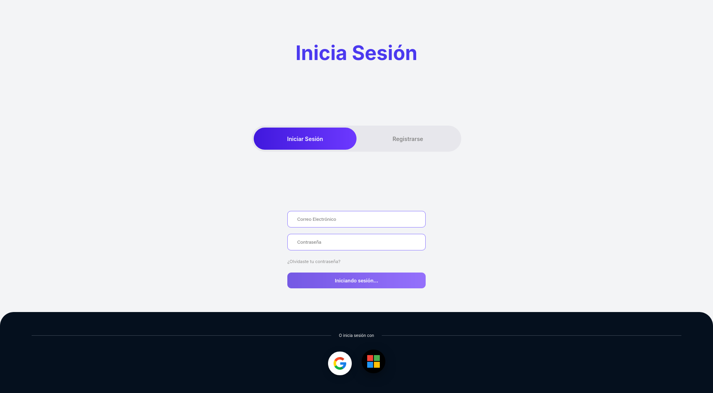

**Figura 15.** Evidencia de ejecución — Flujo de autenticación con Microsoft (proveedor externo).

El listado completo de las **62 capturas** y el resultado de verificación (SIN ERRORES / VALIDACIÓN ACTIVA) de cada página se documentan en el **Anexo H** (`anexos/Anexo_H/`) y en `Evidencias/INDICE_EVIDENCIAS.md`.

---

## 9. DESPLIEGUE DEL SISTEMA

### 9.1 Arquitectura de Despliegue

El sistema actualmente funciona en **entorno de desarrollo local**, con la arquitectura de despliegue mostrada en la Figura 16:

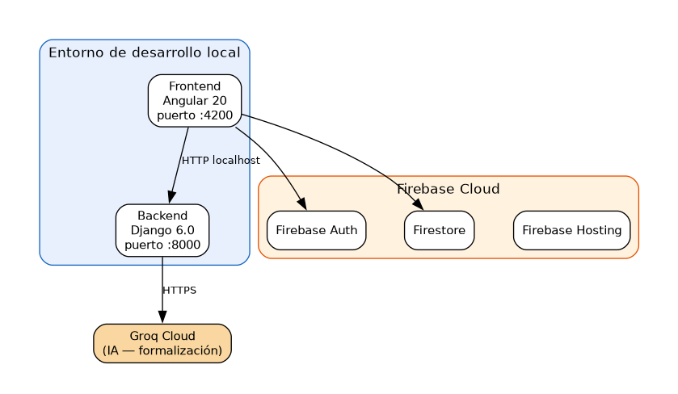

**Figura 16.** Arquitectura de despliegue en entorno de desarrollo local.

El frontend Angular corre en el puerto `:4200` y el backend Django en el puerto `:8000`; ambos consumen los servicios cloud de Firebase (Authentication, Firestore y Hosting) y la Groq API para la formalización de texto con IA.

### 9.2 Servicios Utilizados

Los servicios utilizados se detallan en la Tabla 17 (Servicios utilizados en el proyecto).

**Tabla 17.** Servicios utilizados en el proyecto.

| Servicio | Proveedor | Función |
|----------|-----------|---------|
| Firebase Authentication | Google Cloud | Autenticación multi-proveedor (correo, Google, Microsoft) |
| Firebase Firestore | Google Cloud | Base de datos NoSQL en tiempo real |
| Firebase Hosting | Google Cloud | Hosting del frontend Angular |
| Groq API | Groq Cloud | Formalización de texto con IA (modelo qwen3.8-27b) |
| GitHub Actions | GitHub | CI/CD (build y verificación de código) |
| MediaPipe | Google (client-side) | Detección de manos y landmarks |

### 9.3 Configuración del Entorno Productivo

**(El sistema actualmente no está desplegado en producción. Incluir:)**

**(Pendiente: Configurar despliegue en:)**
- Firebase Hosting para el frontend Angular.
- Un servicio de hosting para el backend Django (Firebase Functions, Google Cloud Run, o similar).
- Variables de entorno production en `environment.prod.ts`.

### 9.4 URL del Sistema

**(Pendiente: Incluir URL de producción una vez se realice el despliegue)**

- Frontend: `(URL de Firebase Hosting o pendiente)`
- Backend: `(URL del servidor Django o pendiente)`
- Swagger/OpenAPI: `(Pendiente de implementar)`

### 9.5 Evidencias de Funcionamiento

Las evidencias de funcionamiento del sistema son **capturas reales de la aplicación en ejecución** (las mismas generadas por la suite Selenium del Anexo H), tomadas en el entorno de desarrollo local mientras el sistema corre con `ng serve`. Relación de evidencias:

- **Aplicación funcionando en el navegador:** capturas `01`-`02` (login), `16` (dashboard admin), `08` (dashboard supervisor) y `21` (sala de espera usuario).
- **Chat en tiempo real entre dos usuarios:** captura `26` (chat directo) y `50` (envío de mensaje).
- **Reconocimiento de señas con cámara activa:** la captura requiere cámara real y sesión autenticada con datos en Firestore. La interfaz del módulo se evidencia en las capturas `14`, `23` y `26`, y el motor de reconocimiento se documenta en el Anexo D.
- **Panel de administración con datos reales:** capturas `16`-`20` (dashboard, usuarios, solicitudes, reportes y configuración del admin).
- **Monitoreo de conversaciones del supervisor:** capturas `10`, `34` (monitoreo) y `55` (filtro por fecha), más el módulo de reportes `11` y `51`-`54`.

Las Figuras 17 y 18 evidencian el funcionamiento de los módulos de monitoreo y reportes con datos reales:

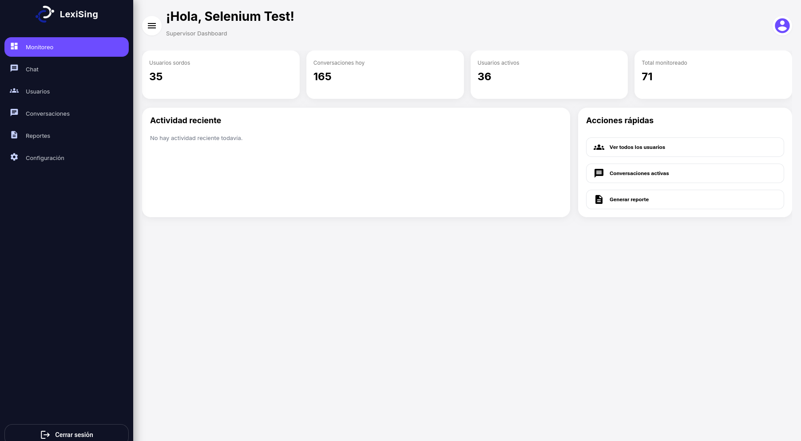

**Figura 17.** Evidencia de funcionamiento — Dashboard del rol supervisor con estadísticas.

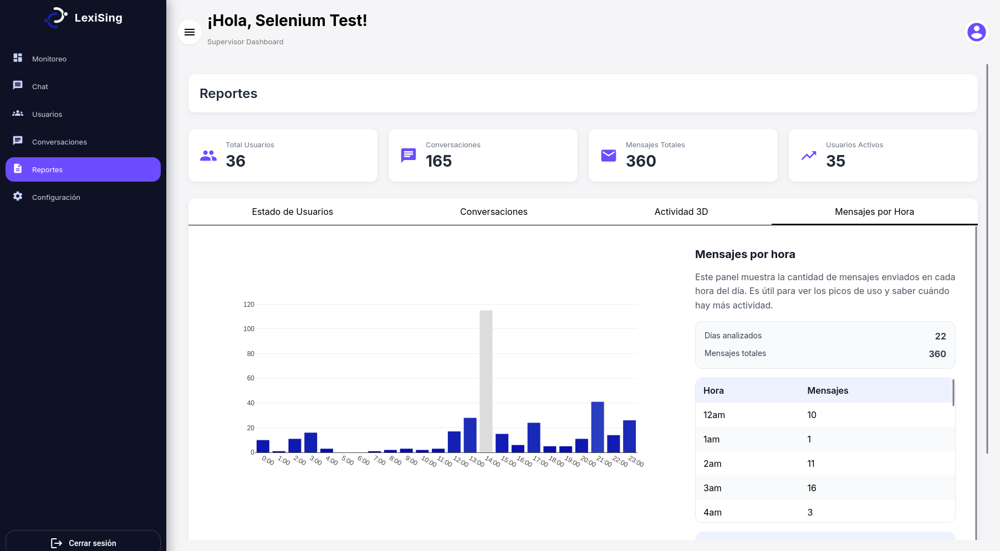

**Figura 18.** Evidencia de funcionamiento — Reporte de mensajes por hora.

> **Nota:** dado que el sistema aún no está desplegado en producción (Sección 9.3), estas evidencias de funcionamiento se tomaron sobre la aplicación corriendo localmente, que es el estado actual del sistema. Cada archivo `.png` está disponible en la carpeta `anexos/Anexo_H/` del Anexo H. (*El enlace de Drive se publicará al subir las evidencias.*)

---

## 10. COSTOS

### 10.1 Estimación de Costos

La estimación de costos se detalla en la Tabla 18 (Estimación de costos del proyecto).

**Tabla 18.** Estimación de costos del proyecto.

| Concepto | Valor (USD) |
|----------|-------------|
| Desarrollo Frontend (Angular + MediaPipe) | (Costo real del equipo) |
| Desarrollo Backend (Django + DRF) | (Costo real del equipo) |
| Diseño de reconocimiento de señas (MediaPipe + clasificación) | (Costo real del equipo) |
| Integración de IA (Groq API) | (Costo real del equipo) |
| Configuración Firebase (Auth, Firestore, Hosting) | (Costo real del equipo) |
| Pruebas y QA | (Costo real del equipo) |
| Documentación y despliegue | (Costo real del equipo) |

### 10.2 Costos Operativos Mensuales

Los costos operativos mensuales se detallan en la Tabla 19 (Costos operativos mensuales).

**Tabla 19.** Costos operativos mensuales.

| Servicio | Costo mensual estimado |
|----------|----------------------|
| Firebase (Authentication + Firestore + Hosting) | Gratis en tier gratuito (Spark plan) |
| Groq API | Gratis en tier gratuito (plan gratuito con límites) |
| GitHub Actions | Gratis para repos públicos |
| Dominio (opcional) | (Costo si se adquiere dominio) |
| **Total mensual** | **$0 USD (durante fase de desarrollo/pruebas)** |

**(Nota: Los costos pueden incrementar al escalar a producción con tráfico real. Firebase cobra por lecturas/escrituras en Firestore y por hosting si se excede el tier gratuito.)**

---

## 11. RESULTADOS OBTENIDOS

### 11.1 Cumplimiento de Objetivos

El cumplimiento de los objetivos se resume en la Tabla 20 (Cumplimiento de los objetivos).

**Tabla 20.** Cumplimiento de los objetivos.

| Objetivo | Estado | Evidencia |
|----------|--------|-----------|
| Implementar autenticación segura con múltiples proveedores | ✅ Cumplido | Login con correo, Google y Microsoft funcionando |
| Desarrollar módulo de reconocimiento de señas (33 palabras + 27 letras) | ✅ Cumplido | MediaPipe HandLandmarker con 33 señas y abecedario LSC completo |
| Implementar servicio de formalización de texto con IA | ✅ Cumplido | Groq API integrada con fallback automático |
| Gestionar conversaciones y mensajes en tiempo real | ✅ Cumplido | Firestore con chat en tiempo real, edición y eliminación |
| Implementar sistema de roles y permisos | ✅ Cumplido | 5 roles con guards y reglas Firestore RBAC |
| Desarrollar panel de administración y monitoreo | ✅ Cumplido | Dashboard con estadísticas, monitoreo con filtros |
| Garantizar accesibilidad y usabilidad | ✅ Cumplido | Angular Material, diseño responsive, indicadores visuales |
| Implementar CI/CD | ✅ Cumplido | GitHub Actions con build y verificación |

### 11.2 Funcionalidades Implementadas

Las funcionalidades implementadas se detallan en la Tabla 21 (Funcionalidades implementadas).

**Tabla 21.** Funcionalidades implementadas.

| Funcionalidad | Estado |
|---------------|--------|
| Inicio de sesión (correo, Google, Microsoft) | ✅ |
| Registro de usuarios | ✅ |
| Recuperación de contraseña | ✅ |
| Reconocimiento de 400+ señas de palabras | ✅ |
| Abecedario dactilológico LSC (27 letras) | ✅ |
| Léxico empresarial (8 señas bimanuales) | ✅ |
| Formalización de texto con IA (Groq API) | ✅ |
| Chat en tiempo real | ✅ |
| Edición de mensajes | ✅ |
| Eliminación de mensajes | ✅ |
| Gestión de conversaciones (crear, listar) | ✅ |
| Prevención de conversaciones duplicadas | ✅ |
| Notificaciones sonoras | ✅ |
| Presencia online/offline | ✅ |
| Panel de administración (dashboard) | ✅ |
| Gestión de usuarios (admin) | ✅ |
| Monitoreo de conversaciones (supervisor) | ✅ |
| Filtros de búsqueda y fecha | ✅ |
| Registro de actividad | ✅ |
| Reglas de seguridad Firestore (RBAC) | ✅ |
| CI/CD con GitHub Actions | ✅ |
| Modo palabras y modo deletreo | ✅ |
| Detección de dos manos | ✅ |
| Detección de movimiento (ondeo, apuntar) | ✅ |
| Letras con movimiento (J, Z) | ✅ |
| Retención extendida para letras ambiguas | ✅ |
| Visualización de landmarks en canvas | ✅ |
| Banner de "mano no detectada" | ✅ |

### 11.3 Beneficios Obtenidos

**Beneficios sociales:**
- Herramienta funcional para la comunicación entre personas sordas y oyentes.
- Promoción de la inclusión social y laboral de personas con discapacidad auditiva.
- Sensibilización sobre la importancia de la accesibilidad digital.

**Beneficios tecnológicos:**
- Aplicación de inteligencia artificial y visión por computador para resolver un problema social.
- Integración de tecnologías modernas (Angular 20, Django 6, Firebase, MediaPipe).
- Desarrollo de un clasificador de señas basado en reglas geométricas.

**Beneficios educativos:**
- Experiencia de desarrollo de software con metodología ágil (Scrum).
- Aprendizaje de arquitectura de software escalable.
- Aplicación de conceptos de seguridad y control de acceso.

---

## 12. CONCLUSIONES

1. **LexiSing demuestra que la tecnología puede ser un motor de inclusión social.** El desarrollo de una plataforma que traduce Lengua de Señas Colombiana en tiempo real mediante visión por computador e inteligencia artificial demuestra que las barreras de comunicación que enfrentan las personas sordas pueden ser mitigadas mediante soluciones tecnológicas accesibles e innovadoras.

2. **La integración de MediaPipe HandLandmarker y Groq API permite un reconocimiento de señas eficiente sin necesidad de infraestructura de servidor pesada.** Al ejecutarse el reconocimiento de señas directamente en el navegador (client-side) y utilizar una API de IA en la nube, se logra una arquitectura ligera, escalable y de bajo costo operativo que puede ser desplegada en cualquier dispositivo con cámara y conexión a internet.

3. **La metodología Scrum permitió organizar el desarrollo en sprints funcionales, facilitando la integración continua y la retroalimentación oportuna.** Cada sprint entregó funcionalidades verificables, desde la autenticación básica hasta el reconocimiento completo de señas, lo que permitió detectar y corregir errores tempranamente (como los 9 errores documentados en el RESUMEN-ERRORES.md).

4. **El sistema de roles y permisos con reglas de seguridad en Firestore garantiza la protección de datos y el acceso adecuado a la información.** La implementación de RBAC con 5 roles diferentes (admin, empleado, sordomudo, supervisor, usuario) asegura que cada usuario acceda únicamente a las funcionalidades y datos correspondientes a su rol.

5. **Aunque el proyecto logra sus objetivos principales, existen áreas de mejora identificadas que pueden ser abordadas en futuras versiones.** Entre ellas se incluyen: la ampliación del vocabulario de señas reconocidas, la implementación de pruebas automatizadas, el despliegue en servidor de producción, y la implementación de una aplicación móvil nativa.

---

## 13. RECOMENDACIONES

1. **Ampliar el vocabulario de señas reconocidas.** El sistema actual reconoce 400+ señas de palabras y 27 letras, lo cual es un vocabulario básico. Se recomienda incorporar un modelo de machine learning entrenado con datos de señas colombianas para reconocer un vocabulario más amplio, incluyendo expresiones faciales y gramática de la LSC.

2. **Implementar pruebas automatizadas.** El proyecto actualmente no cuenta con pruebas unitarias, de integración o end-to-end. Se recomienda implementar pruebas con Jasmine/Karma para Angular y Pytest para Django, alcanzando una cobertura mínima del 80% para garantizar la calidad y mantenibilidad del código.

3. **Desplegar el sistema en un entorno de producción.** Actualmente el sistema solo funciona en entorno de desarrollo local. Se recomienda configurar el despliegue en Firebase Hosting (frontend) y un servicio de hosting para el backend (Google Cloud Run o similar), con dominio propio y certificado SSL.

4. **Implementar una aplicación móvil nativa.** Aunque la versión web es funcional, una aplicación móvil nativa (Android/iOS) permitiría un acceso más cómodo para los usuarios sordos, aprovechando la cámara del dispositivo de manera más directa y ofreciendo notificaciones push.

5. **Documentar la API con Swagger/OpenAPI.** Actualmente los endpoints del backend no están documentados con un estándar de documentación de APIs. Se recomienda integrar drf-spectacular o drf-yasg para generar documentación interactiva de la API.

---

## 14. REFERENCIAS

**(Formato APA 7 —Lista de referencias bibliográficas)**

1. Google. (s.f.). *MediaPipe Hand Landmarker*. Google AI Edge. https://ai.google.dev/edge/mediapipe/solutions/vision/hand_landmarker

2. Google. (s.f.). *Firebase Authentication*. Firebase. https://firebase.google.com/docs/auth

3. Google. (s.f.). *Cloud Firestore*. Firebase. https://firebase.google.com/docs/firestore

4. Groq. (s.f.). *Groq API Documentation*. https://console.groq.com/docs/api-reference

5. Angular. (s.f.). *Angular Documentation*. https://angular.dev/docs

6. Django Software Foundation. (s.f.). *Django Documentation*. https://docs.djangoproject.com/

7. Django REST Framework. (s.f.). *Django REST Framework Documentation*. https://www.django-rest-framework.org/

8. Congreso de la República de Colombia. (2012). *Ley 1581 de 2012: Por la cual se dictan disposiciones generales para la protección de datos personales*. Diario Oficial.

9. Congreso de la República de Colombia. (2009). *Ley 1346 de 2009: Por la cual se adopta la Convención sobre los Derechos de las Personas con Discapacidad*. Diario Oficial.

10. Congreso de la República de Colombia. (2013). *Ley Estatutaria 1618 de 2013: Establece disposiciones para garantizar el ejercicio pleno de los derechos de las personas con discapacidad*. Diario Oficial.

11. Departamento Administrativo Nacional de Estadística — DANE. (s.f.). *Censo Nacional de Población y Vivienda*. https://www.dane.gov.co/

12. Scrum Alliance. (s.f.). *What is Scrum?* https://www.scrumalliance.org/why-scrum

13. Mozilla Developer Network. (s.f.). *WebRTC: Real-Time Communication Between Browsers*. https://developer.mozilla.org/en-US/docs/Web/API/WebRTC_API

14. TensorFlow. (s.f.). *MediaPipe Solutions Guide*. https://developers.google.com/mediapipe

**(Agregar más referencias según se necesite para completar el marco referencial y las fuentes consultadas durante el desarrollo)**

---

## 15. ANEXOS

Los archivos completos correspondientes a cada anexo (código fuente, configuraciones, reglas, capturas de evidencia y documentos) se entregan en la carpeta `anexos/` del proyecto. Cada anexo incluye el enlace a su carpeta dentro de `anexos/` (los enlaces de Google Drive se publicarán al subir las evidencias).

### Anexo A: Estructura de directorios del proyecto

Árbol real del repositorio (`/home/samuel/Proyectos/LexiSing`), excluyendo `node_modules`, `.git`, `dist` y cachés.

**Enlace:** [`anexos/Anexo_A/`](anexos/Anexo_A/) — archivo `Estructura_Directorios.txt`.

### Anexo B: Configuración de Firebase

Configuración real de Firebase del frontend (`src/environments/environment.ts`) y reglas de Firestore (Anexo F). Las capturas de la consola de Firebase requieren acceso a la cuenta de Google del proyecto `lexising`.

**Enlace:** [`anexos/Anexo_B/`](anexos/Anexo_B/) — archivo `environment.ts`.

### Anexo C: Configuración de variables de entorno

Archivos de entorno del frontend (`environment.ts`, `environment.prod.ts`) y del backend (`.env.example`) sin datos sensibles.

**Enlace:** [`anexos/Anexo_C/`](anexos/Anexo_C/) — archivos `environment.ts`, `environment.prod.ts`, `.env.example`.

### Anexo D: Código fuente del servicio de reconocimiento de señas

Archivo completo del servicio Angular que integra MediaPipe HandLandmarker para el reconocimiento de LSC (modos palabras y deletreo).

**Enlace:** [`anexos/Anexo_D/`](anexos/Anexo_D/) — archivo `sign-language.service.ts`.

### Anexo E: Código fuente del servicio de formalización de IA

Archivo completo del servicio `GroqService` (Django REST Framework) que formaliza las glosas de señas en texto formal usando la API de Groq.

**Enlace:** [`anexos/Anexo_E/`](anexos/Anexo_E/) — archivo `services.py`.

### Anexo F: Reglas de seguridad Firestore

Archivo completo de reglas de seguridad de Firestore desplegadas para el proyecto (`firestore.rules`).

**Enlace:** [`anexos/Anexo_F/`](anexos/Anexo_F/) — archivo `firestore.rules`.

### Anexo G: Configuración de CI/CD

Pipeline de integración continua con GitHub Actions que ejecuta el build del frontend y el chequeo del backend.

**Enlace:** [`anexos/Anexo_G/`](anexos/Anexo_G/) — archivo `ci.yml`.

### Anexo H: Evidencias de pruebas automatizadas (Selenium)

Capturas de pantalla de la aplicación generadas automáticamente por la suite Selenium WebDriver + Firefox (Java/Maven). Incluye las **62 capturas**, el índice automático `INDICE_EVIDENCIAS.md` y la imagen de prueba para la subida de foto de perfil.

**Enlace:** [`anexos/Anexo_H/`](anexos/Anexo_H/) — carpeta de evidencias completa.

### Anexo J: Documento de propuesta técnica y económica

Propuesta técnica y económica del proyecto, entregable del programa ADSO-SENA (detallada en los Puntos 4 y 10 del informe).

**Enlace:** [`anexos/Anexo_J/`](anexos/Anexo_J/) — archivo `Propuesta_Tecnica_Economica.md`.

### Anexo K: Bitácora de sprints

Bitácora completa de los 4 sprints del proyecto (fechas, objetivo, actividades/entregables y estado) desarrollado con metodología Scrum.

**Enlace:** [`anexos/Anexo_K/`](anexos/Anexo_K/) — archivo `Bitacora_Sprints.md`.
